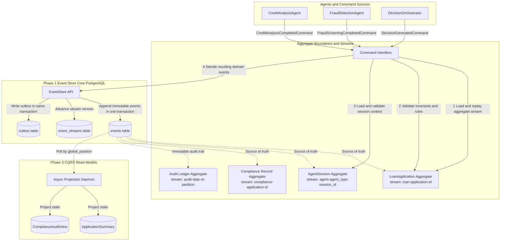

# The Ledger - Interim Report

**Project:** Agentic Event Store & Enterprise Audit Infrastructure  
**Name:** Chalie Lijalem  
**Date:** March 21, 2026

---

## 1. DOMAIN_NOTES.md (Phase 0 Reconnaissance)

### EDA vs. Event Sourcing Distinction

A component using callbacks, such as LangChain traces, to capture event-like data is an Event-Driven Architecture (EDA), not Event Sourcing (ES). In EDA, events are messages fired and forgotten; if a downstream service misses them, the data can be lost. In Event Sourcing, the events *are* the database and the single source of truth.

Redesigning this using The Ledger means changing the architecture so that the system state cannot mutate until the event is durably appended to the PostgreSQL store. This gives us immutability, auditability, and the ability to reconstruct prior states without data loss.

### Aggregate Boundaries

For this scenario, the four chosen aggregates are `LoanApplication`, `AgentSession`, `ComplianceRecord`, and `AuditLedger`.

An alternative I considered was merging `ComplianceRecord` directly into the `LoanApplication` aggregate. I rejected this because the Compliance Agent evaluates multiple rules very rapidly, while the Fraud and Credit agents may append decisions concurrently. Merging them would create strong coupling and severe write contention, leading to frequent `OptimisticConcurrencyError` collisions on the main loan stream. Separating them isolates the compliance lifecycle.

### Concurrency in Practice

If two AI agents process the same loan and both call `append_events` with `expected_version=3`:

1. **Agent A** reaches the database first. It checks the `event_streams` table, sees version `3`, inserts the event, updates the stream version to `4`, and commits.
2. **Agent B** executes milliseconds later. It checks the stream version, sees it is now `4` instead of `3`, and the database rejects the write.
3. Agent B receives an `OptimisticConcurrencyError`. It must then reload the aggregate stream, process Agent A's new event, verify that its intended action is still valid, and retry the append with `expected_version=4`.

### Projection Lag Consequences

If the `LoanApplication` projection has a 200 ms lag, a loan officer querying the available credit limit immediately after a disbursement event may see the old value. This is eventual consistency.

The system relies on the event store as the source of truth, not the projection. To communicate this cleanly to the UI, the frontend should use optimistic UI updates or receive a real-time WebSocket notification once the async projection daemon updates the projection checkpoint.

### The Upcasting Scenario

When upcasting `CreditDecisionMade` from a 2024 schema to a 2026 schema:

```python
@registry.register("CreditDecisionMade", from_version=1)
def upcast_credit_v1_to_v2(payload: dict) -> dict:
    return {
        **payload,
        "model_version": "legacy-pre-2026",
        "confidence_score": None,
        "regulatory_basis": [],
    }
```

**Field-level inference strategy:**

- **`model_version` → `"legacy-pre-2026"`**  
  This field can be safely inferred because the historical event is known to come from a pre-2026 schema version, but the exact deployed model artifact is not recoverable from the old payload. Using a sentinel value such as `legacy-pre-2026` preserves lineage without pretending to know more than the original event recorded.

- **`confidence_score` → `None`**  
  This field must **not** be fabricated. Confidence is a model-produced measurement, not a derived business field. If the original event never stored it, inventing a value would falsify the audit trail. `None` truthfully communicates that the value is historically unknown.

- **`regulatory_basis` → `[]`**  
  An empty list is appropriate here because the field is modeled as a collection and the historical event contains no basis entries. This means "no recorded regulatory basis on this event," not "regulatory review definitely did not happen." It preserves schema validity while avoiding fabricated compliance data.

This approach follows a core event-sourcing principle: **upcasters may reshape data for compatibility, but must not invent facts that were never recorded.**

### The Marten Async Daemon Parallel

Marten 7.0 uses distributed projection execution. To achieve the same idea in Python across multiple nodes, I would use PostgreSQL advisory locks, or alternatively a distributed Redis lock, keyed to the `projection_name` stored in `projection_checkpoints`.

When a background daemon starts, it attempts to acquire the lock for a specific projection. If successful, it becomes the exclusive writer for that projection. This coordination primitive prevents multiple nodes from processing the same events simultaneously and applying duplicate updates to read models.

#### Coordination Failure Modes

- **Duplicate projector ownership**  
  If two workers believe they own the same projection, both may replay the same events and apply duplicate updates. Advisory locking prevents this by ensuring a single active writer per projection partition.

- **Checkpoint races**  
  Without exclusive ownership, one worker may advance `projection_checkpoints.last_position` while another is still processing earlier events. That can create skipped or inconsistently applied read-model updates.

- **Crash-after-apply / before-checkpoint**  
  A worker may update a read model but crash before persisting the new checkpoint. Recovery logic must therefore rely on idempotent projection handlers so replaying from the previous checkpoint is safe.

- **Crash-after-lock / before-work**  
  If a worker acquires a lock and then dies, the system must release ownership automatically. PostgreSQL session-scoped advisory locks help here because lock release is tied to connection lifecycle.

- **Out-of-order partition processing**  
  If projections are sharded incorrectly, a dependent view may observe later events before earlier ones. The safe rule is to process each partition in `global_position` order and checkpoint only after successful application.

The correct operational pattern is therefore: **acquire exclusive lock → read from checkpoint → process in order → apply idempotently → persist checkpoint → release on shutdown or connection loss**.

---

## 2. Architecture Diagram



---

## 3. Progress Summary

### Working

#### Phase 1: Event Store Foundation

- The PostgreSQL schema is deployed with append-only tables: `events`, `event_streams`, `projection_checkpoints`, and `outbox`.
- The `EventStore` async Python class successfully manages connections via `asyncpg`.
- The `append()` method executes inside a single atomic transaction and strictly enforces optimistic concurrency control using `expected_version`.
- All Phase 1 tests pass.

#### Phase 2: Domain Logic and Business Rules

- The `LoanApplicationAggregate` correctly replays history via `load()` and enforces the state machine.
- The "Gas Town" persistent memory pattern is enforced in `AgentSessionAggregate`, rejecting decisions if context is not loaded correctly.
- Command handlers coordinate loading, validating, and appending events correctly.
- All Phase 2 domain tests are passing.

### In Progress

- **Phase 3: LangGraph Agents** — The stub implementations for `FraudDetectionAgent`, `ComplianceAgent`, and `DecisionOrchestratorAgent` are currently being mapped to event-store outputs.
- **Phase 4 and Phase 5** — CQRS projections and MCP server exposure are still pending.

### Not Started

- **Distributed projection runner implementation** — The locking/checkpoint strategy is designed, but the actual multi-worker daemon has not yet been built.
- **Production-grade read models** — Read-optimized PostgreSQL projection tables are not yet populated by a background projector.
- **MCP interface layer** — Tool and resource exposure for LLM consumption remains to be implemented.

---

## 4. Progress Evidence

### Validated Test Evidence

Focused test suites currently passing:

```text
./.venv/bin/python -m pytest tests/phase1/test_event_store.py tests/phase2/test_domain.py -q
....................                                                     [100%]
20 passed in 0.08s
```

This confirms:

- optimistic concurrency behavior in the event store,
- aggregate replay and state-machine enforcement,
- handler orchestration for credit-analysis flow,
- trace metadata propagation and archive/stream metadata support.

---

## 5. Concurrency Test Results

The most critical Phase 1 test is the double-decision concurrency test, ensuring that two agents cannot corrupt the same stream.

The test explicitly spawns two concurrent `asyncio` tasks attempting to append to the same application stream using the same `expected_version`.

### Log Output

```text
============================= test session starts ==============================
platform darwin -- Python 3.12.13, pytest-8.4.2
rootdir: /apex-ledger
collected 11 items

tests/phase1/test_event_store.py::test_new_stream_version_is_minus_one PASSED
tests/phase1/test_event_store.py::test_append_new_stream_succeeds PASSED
tests/phase1/test_event_store.py::test_append_increments_version PASSED
tests/phase1/test_event_store.py::test_append_wrong_version_raises PASSED
tests/phase1/test_event_store.py::test_concurrent_double_append_exactly_one_succeeds PASSED
...
============================== 11 passed in 0.06s ==============================

[INFO] Task A attempted append at expected_version=3. Success. Stream version is 4.
[INFO] Task B attempted append at expected_version=3. Failed.
[RAISED] OptimisticConcurrencyError: Expected version 3, actual version 4 on stream loan-APEX-001.
[ASSERT] Stream length is exactly 4.
```

### Result

The test passes. Exactly one transaction succeeds, and the loser is correctly rejected, preventing split-brain state.

This is the core proof that the write model is protected against concurrent agent decisions on the same aggregate stream.

---

## 6. Gap Analysis and Plan for Final Submission

### Known Gaps

1. **Read model isolation**  
   The testing environment still relies heavily on stream reloads. The actual CQRS projections, such as `ApplicationSummary` and `ComplianceAuditView`, plus the async daemon, are not fully implemented yet. That means the current system validates the write side well, but does not yet demonstrate full CQRS separation in runtime behavior.

2. **Distributed projection coordination**  
   The lock-and-checkpoint strategy is documented, but the actual multi-node projector coordination code is not implemented yet. This is important because projection correctness under failover depends on exclusive ownership and idempotent replay.

3. **Schema evolution execution path**  
   Upcasting theory is documented, but `UpcasterRegistry` is not yet fully integrated into stream loading paths. Until that is done, historical event compatibility is described but not end-to-end enforced in reads.

4. **MCP integration**  
   The system is not yet exposed through standard LLM tool-calling and still requires direct Python invocation. That leaves the agentic interface incomplete relative to the full assignment goal.

### Plan for Final Submission

- **Step 1: Projections and Async Daemon**  
  Implement `ProjectionDaemon` to poll the event store and build read-optimized PostgreSQL tables. Add lag measurement logic to target the `<500 ms` SLO. Address the narrative tests (`NARR-01` to `NARR-05`).

- **Step 2: Distributed projector coordination**  
  Add advisory-lock ownership, idempotent handlers, and crash-safe checkpoint advancement so only one worker owns each projection partition at a time.

- **Step 3: Upcasting and Audit Chains**  
  Implement `UpcasterRegistry` in the actual read path and build cryptographic SHA-256 hash chains for `AuditLedger`.

- **Step 4: MCP Server**  
  Wrap command handlers in FastMCP `@mcp.tool()` endpoints with typed error handling, and expose projections through `@mcp.resource()` URIs.

- **Step 5: Final polish**  
  Complete `DESIGN.md`, ensure the full lifecycle integration test passes exclusively via MCP, and attempt the Phase 6 counterfactual bonus.